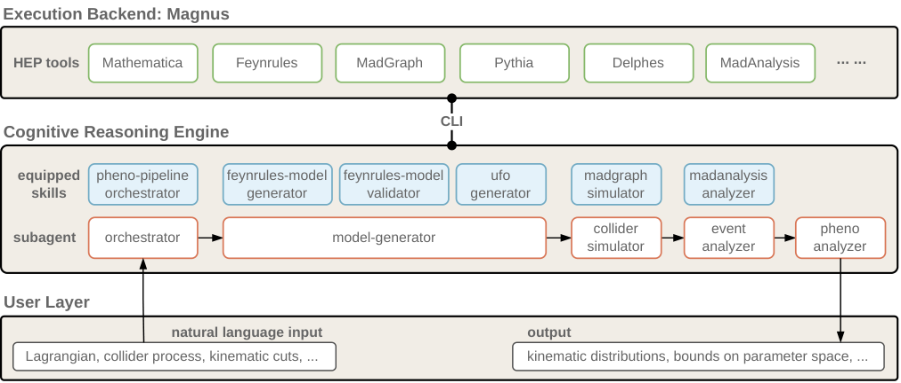

# Collider-Agent

An end-to-end **multi-agent system with agent skills** for reproducing collider phenomenology results in high-energy physics.

## Roadmap

| Status | Feature |
|:------:|---------|
| :green_square: | FeynRules model generation from LaTeX Lagrangian |
| :green_square: | FeynRules model validation (Hermiticity, mass diagonalization, kinetic terms) |
| :green_square: | UFO model generation for MadGraph5 |
| :green_square: | MadGraph5 event generation with Pythia8 parton shower |
| :green_square: | Delphes detector simulation |
| :green_square: | MadAnalysis5 normal mode analysis |
| :green_square: | Multi-agent orchestration for full pipeline |
| :white_large_square: | MadAnalysis5 expert mode support |
| :white_large_square: | Fine-grained parameter tuning for Pythia and other packages |
| :white_large_square: | More paper reproduction examples (contributions welcome!) |

## Overview

Collider-Agent enables AI coding agents (such as Claude Code, Cursor, Windsurf, etc.) to autonomously reproduce collider phenomenology results from physics papers. The system combines:

- **Specialized Sub-agents**: Domain-specific agents for model building, simulation, and analysis
- **Agent Skills**: Reusable skill modules that interface with HEP tools via the Magnus cloud platform

### Architecture

<p align="center">
  
</p>

## Installation

### Prerequisites

- [Claude Code](https://claude.ai/claude-code) CLI installed and configured
- Python 3.10+
- `magnus-sdk` for cloud execution of HEP tools

### Setup

1. Clone this repository:

```bash
git clone https://github.com/your-org/Collider-Agent.git
cd Collider-Agent
```

2. Install dependencies:

```bash
pip install -e .
```

3. Copy the agents and skills to your local configuration directory.

**For Claude Code:**

```bash
cp -r src/agents ~/.claude/agents
cp -r src/skills ~/.claude/skills
```

**For other compatible AI coding agents** (e.g., Cursor, Windsurf, or custom agent frameworks):

Copy the `src/agents/` and `src/skills/` directories to your agent's configuration path. The agents and skills follow a standard markdown-based format and are designed to be portable across different agent systems that support sub-agents and skill definitions.

4. Restart your agent to load the new agents and skills.

## Usage

### Basic Workflow

1. Prepare a prompt file describing the target paper and figure to reproduce (see `paper-reproduction/` for examples)

2. Start Claude Code and provide the prompt:

```bash
claude
```

3. The system will orchestrate the full pipeline:
   - Parse the Lagrangian and generate FeynRules model
   - Validate and generate UFO model
   - Run MadGraph5 simulations
   - Apply analysis cuts with MadAnalysis5
   - Generate the target figure

### Example Prompts

See the `paper-reproduction/` directory for example prompts used in our paper, organized by arXiv ID:

- `1308.2209/` - Heavy Majorana neutrino production
- `1605.02910/` - Z' and heavy Higgs phenomenology
- `1701.05379/` - Mono-Higgs and mono-Z/W signatures
- `2103.02708/` - CMS BSM searches
- And more...

## Repository Structure

```
Collider-Agent/
├── src/                          # Core agents and skills
│   ├── agents/                   # Sub-agent definitions
│   │   ├── model-generator.md
│   │   ├── collider-simulator.md
│   │   ├── event-analyzer.md
│   │   └── pheno-analyzer.md
│   └── skills/                   # Agent skill modules
│       ├── feynrules-model-generator/
│       ├── feynrules-model-validator/
│       ├── ufo-generator/
│       ├── madgraph-simulator/
│       ├── madanalysis-analyzer/
│       └── magnus/
├── paper-reproduction/           # Example prompts from paper
├── pyproject.toml
├── .gitignore
└── README.md
```

## Sub-agents

| Agent | Description |
|-------|-------------|
| `model-generator` | Handles LaTeX → FeynRules → UFO pipeline |
| `collider-simulator` | Runs MadGraph5 with Pythia8/Delphes |
| `event-analyzer` | Performs MadAnalysis5 analysis |
| `pheno-analyzer` | Coordinates full phenomenology studies |

## Skills

| Skill | Description |
|-------|-------------|
| `feynrules-model-generator` | Generate .fr files from LaTeX Lagrangians |
| `feynrules-validator` | Validate .fr models via Mathematica |
| `ufo-generator` | Generate UFO models from .fr files |
| `madgraph-simulator` | Run MadGraph5 event generation |
| `madanalysis-analyzer` | Perform event analysis |
| `magnus` | Interface with Magnus cloud platform |

## Citation

If you use Collider-Agent in your research, please cite:

```bibtex
@misc{collider-agent,
  author = {Qiu, Shi and Cai, Zeyu and Wei, Jiashen and Li, Zeyu and Yin, Yixuan and Cao, Qing-Hong and Liu, Chang and Luo, Ming-xing and Yuan, Xing-Bo and Zhu, Hua Xing},
  title = {A Decoupled Architecture for Autonomous High-Energy Physics Phenomenology: Application to Collider Studies},
  year = {2025},
  howpublished = {\url{https://github.com/HET-AGI/ColliderAgent}},
  note = {Preprint}
}
```

## License

MIT License - see [LICENSE](LICENSE) for details.

## Acknowledgments

We thank the developers of FeynRules, MadGraph5_aMC@NLO, Pythia8, Delphes, and MadAnalysis5 for their excellent tools that make this work possible.
