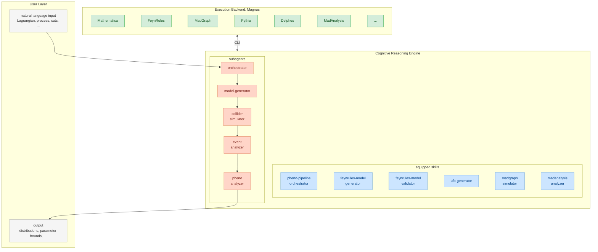

<!-- prettier-ignore -->

<div align="center">

# ⚛ Collider-Agent

**Autonomous multi-agent system for high-energy physics phenomenology**

[](LICENSE)
[](https://www.python.org)
[](https://claude.ai/code)


> From a LaTeX Lagrangian to a publication-ready figure — fully automated.

[Overview](#overview) • [Quickstart](#quickstart) • [Installation](#installation) • [Examples](#example-prompts) • [Citation](#citation)

</div>



## Overview

Collider-Agent enables AI coding agents (Claude Code, Cursor, Windsurf, and more) to autonomously reproduce collider phenomenology results from physics papers. It combines specialized sub-agents and reusable skill modules that interface with standard HEP tools via the [Magnus]() cloud platform — no local HEP software installation required.

**Full pipeline, fully automated:**

- Parse a LaTeX Lagrangian and generate a FeynRules model
- Validate the model and produce a UFO output for MadGraph5
- Run parton-level and showered event generation with MadGraph5 + Pythia8
- Apply detector simulation (Delphes) and analysis cuts (MadAnalysis5)
- Generate the target figure, ready for comparison with the paper

## Roadmap

| Status | Feature                                                                       |
|:------:| ----------------------------------------------------------------------------- |
| ✅      | FeynRules model generation from LaTeX Lagrangian                              |
| ✅      | FeynRules model validation (Hermiticity, mass diagonalization, kinetic terms) |
| ✅      | UFO model generation for MadGraph5                                            |
| ✅      | MadGraph5 event generation with Pythia8 parton shower                         |
| ✅      | Delphes detector simulation                                                   |
| ✅      | MadAnalysis5 normal mode analysis                                             |
| ✅      | Multi-agent orchestration for full pipeline                                   |
| ⬜      | MadAnalysis5 expert mode support                                              |
| ⬜      | Fine-grained parameter tuning for Pythia and other packages                   |
| ⬜      | More paper reproduction examples (contributions welcome!)                     |

## Installation

### Prerequisites

- [Claude Code](https://claude.ai/code) — recommended; provides full support for both sub-agents and skills
  
  > Other agents with skills support also work (skills only, no sub-agents): Cursor, Windsurf, Gemini CLI, Cline, Goose, Roo Code, and [more](#supported-agents-and-their-global-skills-paths)

- Python 3.10+

### Setup

**1. Clone the repository:**

```bash
git clone https://github.com/HET-AGI/ColliderAgent.git
cd ColliderAgent
```

**2. Install the Python package:**

```bash
pip install -e .
```

**3. Copy agents and skills to your agent's configuration directory.**

For **Claude Code** (full support: sub-agents + skills):

```bash
cp -r src/agents ~/.claude/agents
cp -r src/skills ~/.claude/skills
```

For **other agents** (skills only):

```bash
# Replace <skills-path> with the global skills path for your agent (see table below)
cp -r src/skills <skills-path>
```

<a id="supported-agents-and-their-global-skills-paths"></a>

**Supported agents and their global skills paths:**

| Agent          | Global skills path            |
| -------------- | ----------------------------- |
| Claude Code    | `~/.claude/skills/`           |
| Cursor         | `~/.cursor/skills/`           |
| Windsurf       | `~/.codeium/windsurf/skills/` |
| GitHub Copilot | `~/.copilot/skills/`          |
| Gemini CLI     | `~/.gemini/skills/`           |
| Cline / Warp   | `~/.agents/skills/`           |
| Goose          | `~/.config/goose/skills/`     |
| Roo Code       | `~/.roo/skills/`              |
| OpenCode       | `~/.config/opencode/skills/`  |
| Codex          | `~/.codex/skills/`            |

> [!TIP]
> Project-scoped installation is also supported. Copy `src/skills/` into `.claude/skills/` (or the equivalent directory for your agent) at the root of your working directory to scope the skills to that project only.

**4. Restart your agent** to load the new agents and skills.

## Quickstart

The fastest way to try Collider-Agent is to run a standard-model dilepton invariant mass plot — a classic parton-level check — directly from the command line:

```bash
claude -p "Plot the dilepton invariant mass distribution for parton-level pp -> l+l- process at the 14 TeV LHC in the SM." --dangerously-bypass-permissions
```

This runs the full pipeline non-interactively: MadGraph5 generates the events via Magnus, and the agent produces a normalized $m_{\ell\ell}$ histogram in your working directory.

## Usage

### Basic Workflow

1. Prepare a prompt describing the target paper and figure to reproduce (see `paper-reproduction/` for examples)

2. Start your agent and provide the prompt:

```bash
claude
```

3. The system orchestrates the full pipeline:
   - Parse the Lagrangian and generate a FeynRules model
   - Validate and generate the UFO model
   - Run MadGraph5 simulations with Pythia8 / Delphes
   - Apply analysis cuts with MadAnalysis5
   - Generate the target figure

### Example Prompts

The `paper-reproduction/` directory contains example prompts organized by arXiv ID:

| Paper                                        | Topic                              |
| -------------------------------------------- | ---------------------------------- |
| [1308.2209](paper-reproduction/1308.2209/)   | Heavy Majorana neutrino production |
| [1605.02910](paper-reproduction/1605.02910/) | Z′ and heavy Higgs phenomenology   |
| `1701.05379/`                                | Mono-Higgs and mono-Z/W signatures |
| `2103.02708/`                                | CMS BSM searches                   |

## Repository Structure

```
ColliderAgent/
├── src/
│   ├── agents/                        # Sub-agent definitions (Claude Code)
│   │   ├── model-generator.md
│   │   ├── collider-simulator.md
│   │   ├── event-analyzer.md
│   │   └── pheno-analyzer.md
│   └── skills/                        # Agent skill modules (all agents)
│       ├── feynrules-model-generator/
│       ├── feynrules-model-validator/
│       ├── ufo-generator/
│       ├── madgraph-simulator/
│       ├── madanalysis-analyzer/
│       ├── pheno-pipeline-orchestrator/
│       └── magnus/
├── paper-reproduction/                # Example prompts from paper
│   ├── 1308.2209/
│   ├── 1605.02910/
│   └── ...
├── pyproject.toml
└── README.md
```

## Sub-agents

> [!NOTE]
> Sub-agents are currently supported by Claude Code only. Users of other agents can use the skills directly via the agent's built-in skill invocation mechanism.

| Agent                | Description                                       |
| -------------------- | ------------------------------------------------- |
| `model-generator`    | LaTeX → FeynRules → UFO pipeline                  |
| `collider-simulator` | MadGraph5 event generation with Pythia8 / Delphes |
| `event-analyzer`     | MadAnalysis5 cut-flow and histogram analysis      |
| `pheno-analyzer`     | Orchestrates the full phenomenology study         |

## Skills

| Skill                         | Description                                       |
| ----------------------------- | ------------------------------------------------- |
| `feynrules-model-generator`   | Generate `.fr` model files from LaTeX Lagrangians |
| `feynrules-model-validator`   | Validate `.fr` models via Mathematica checks      |
| `ufo-generator`               | Export FeynRules models to UFO format             |
| `madgraph-simulator`          | Run MadGraph5_aMC@NLO event generation            |
| `madanalysis-analyzer`        | Perform cut-flow analysis and produce histograms  |
| `pheno-pipeline-orchestrator` | Coordinate the end-to-end phenomenology pipeline  |
| `magnus`                      | Interface with the Magnus cloud HEP platform      |

## Citation

If you use Collider-Agent in your research, please cite:

```bibtex
@misc{collider-agent,
  author = {Qiu, Shi and Cai, Zeyu and Wei, Jiashen and Li, Zeyu and Yin, Yixuan and Cao, Qing-Hong and Liu, Chang and Luo, Ming-xing and Yuan, Xing-Bo and Zhu, Hua Xing},
  title  = {A Decoupled Architecture for Autonomous High-Energy Physics Phenomenology: Application to Collider Studies},
  year   = {2025},
  howpublished = {\url{https://github.com/HET-AGI/ColliderAgent}},
  note   = {Preprint}
}
```

## Acknowledgments

We thank the developers of FeynRules, MadGraph5_aMC@NLO, Pythia8, Delphes, and MadAnalysis5 for their excellent tools that make this work possible.
